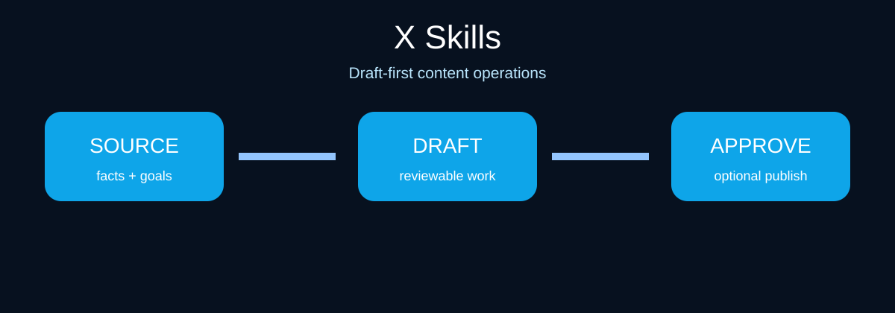

# X Skills for Claude Code and Codex

[](.claude-plugin/plugin.json)
[](.codex-plugin/plugin.json)
[](SKILL.md)
[](https://socialbu.com/mcp-server)
[](LICENSE)

**X Skills** is a draft-first operating kit for credible X posts, threads, quote posts, replies, profile copy, and content experiments. Give your agent source material and a goal; it produces reviewable work without inventing results, claiming live X access, or publishing by default.



## Start here

1. Install the bundle in Claude Code, Codex, or another `SKILL.md`-compatible agent.
2. Supply real material: product notes, a source link, customer language, a transcript, or an existing draft.
3. Ask for one concrete outcome, such as a post, a thread, a reply queue, or a weekly plan.
4. Review the claims, voice, links, and media before posting. Optionally hand the approved draft to SocialBu for scheduling.

## Install

### Codex CLI
```bash
codex plugin marketplace add samalyxx/x-skills
codex plugin add x-skills@x-skills
```

### Claude Code
```text
/plugin marketplace add samalyxx/x-skills
/plugin install x-skills@x-skills
```

### Local or any compatible agent
```bash
git clone https://github.com/samalyxx/x-skills.git
cd x-skills
npx skills add .
```

No API key is needed for writing, planning, or review.

## Ask for work in plain language

- “Turn these release notes into an X post for technical founders. Keep every claim verifiable.”
- “Build a seven-post thread from this article. Give each post one job and avoid clickbait.”
- “Draft three useful replies to these customer questions; flag anything that needs an owner.”
- “Analyze this export and give me observations, hypotheses, and one next test.”

## The 12 skills

| Skill | Use it for |
| --- | --- |
| Post writer | A concise, evidence-led post with a clear audience and supported claim. |
| Thread architect | A structured thread with a truthful opening, progression, and close. |
| Quote-post analyst | Commentary that contributes a real, source-faithful point of view. |
| Reply handler | Owner-aware replies to supplied comments and mentions. |
| Content planner | Testable themes, briefs, cadence, and measurement questions. |
| Humanizer | Better rhythm and specificity without fabricated experience. |
| Repurposer | X-native adaptations that retain the source’s meaning. |
| Profile optimizer | Clearer bio, positioning, and proof points from supplied facts. |
| Community manager | Triage queues, response priorities, risks, and escalation routes. |
| Social listener | Synthesis from material you provide; never a claim of live monitoring. |
| Analytics | Findings separated from hypotheses and follow-up experiments. |
| Safety review | Claim, disclosure, tone, and approval-readiness check. |

## Optional: schedule or publish with SocialBu

X Skills is the writing and review layer. [SocialBu](https://socialbu.com/publish) is optional for account connection, drafts, scheduling, and publishing.

1. In SocialBu, open **Accounts** and connect the intended X account.
2. Add `https://socialbu.com/mcp` to your MCP-compatible client and complete OAuth in your own browser.
3. Ask the agent to create or refine a draft first.
4. Before any SocialBu action, the agent must show the exact final text, account, links/media, action (**save draft**, **schedule**, or **publish now**), and time/timezone.
5. Only a fresh confirmation for that unchanged preview permits execution. Any edit requires a new confirmation.

You can also copy an approved draft into SocialBu manually. See [the publishing boundary](references/socialbu-publishing.md).

## Verify a checkout

```bash
./scripts/validate.sh
python3 -m unittest discover -s tests
python3 scripts/selftest.py
```

## Contribute and license

Read [CONTRIBUTING.md](CONTRIBUTING.md), [CLAUDE.md](CLAUDE.md), and [SECURITY.md](SECURITY.md). MIT licensed; see [LICENSE](LICENSE). This independent project is not affiliated with X, Claude, Codex, or SocialBu.

## Related open-source skill bundles

Part of a family of platform-specific, draft-first skill bundles for Claude Code and Codex:

- [LinkedIn Skills](https://github.com/samalyxx/linkedin-skills) — professional content and engagement
- [Instagram Skills](https://github.com/samalyxx/instagram-skills) — carousels, Reels, captions, and community
- [YouTube Skills](https://github.com/samalyxx/youtube-skills) — videos, thumbnails, metadata, and channel planning
- [Threads Skills](https://github.com/samalyxx/threads-skills) — conversational posts and reply series
- [TikTok Skills](https://github.com/samalyxx/tiktok-skills) — short-form concepts, hooks, scripts, and responses
- [Facebook Skills](https://github.com/samalyxx/facebook-skills) — Pages, events, campaigns, and community work
